# Arduino_Constrained_MPC_Library
This is a compact **sub-millisecond** Constrained (linear) Model Predictive Control (MPC) library for Teensy4.0/Arduino system (or real time embedded system in general).
- It's not using Eigen (small source code - more simple to understand).
- It's not using C++ Standard Library/std (for embedded consideration).
- If you set `SYSTEM_IMPLEMENTATION` to `SYSTEM_IMPLEMENTATION_EMBEDDED_NO_PRINT` in `konfig.h`, the code is platform agnostic (not using any library beside these C header files: `stdlib.h`, `stdint.h`, `stdbool.h`, `string.h`, and `math.h`).
- There's no malloc/new/free dynamic memory allocation for real time application (but using heavy stack local variables, so you need to run it through static memory analyzer if you are really concerned about implement this in mission critical hard real time application).

The unconstrained MPC version can be found in [my other repository](https://github.com/pronenewbits/Arduino_Unconstrained_MPC_Library/).

# The Background
This is the continuation of my previous repo [Arduino_Unconstrained_MPC_Library](https://github.com/pronenewbits/Arduino_Unconstrained_MPC_Library/), so you should read it before continue. As with my other repo, the main goal is for the student to learn the MPC concept (I've made decision to sacrifice speed to get best code readability I could get) while still capable of tackling real-time control system implementation. For non-trivia application, the code is computed in around **886 us** for naive implementation, **327 us** for the optimized version, and **127 us** for the optimized version without matrix bounds checking (even as low as **13-28 us** for a lower quality control output)! See [*Some Benchmark*](README.md#some-benchmark) section below.

To recap, the MPC formula derivation can be described as (I'm using Jan Maciejowski's *Predictive Control with Constraints* as reference, great book btw) :
<p align="center">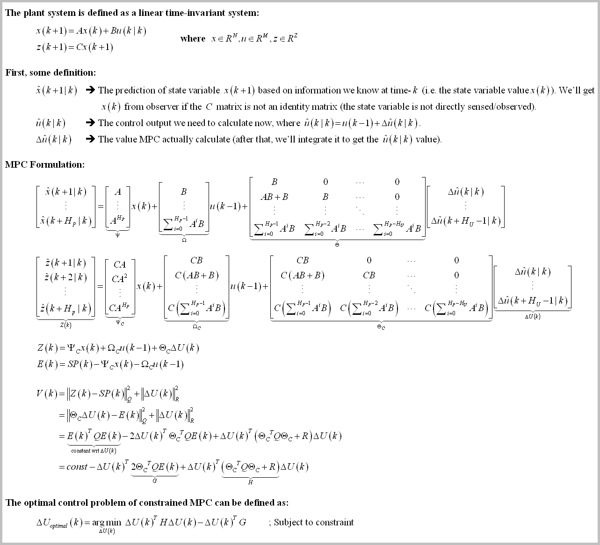
As we can see here, the formulation of constrained MPC is exactly the same as 
<a href="https://github.com/pronenewbits/Arduino_Unconstrained_MPC_Library#the-background">the unconstrained version</a>. The difference is on the optimal control problem definition where the constrained version, well, has constraints.</p>

  

We have 3 type of constraints:
1. 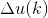 constraint (i.e. 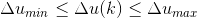), or the actuator slew rate constraint.
2. 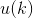 constraint (i.e. 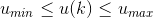), or the actuator output constraint.
3. 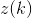 constraint (i.e. 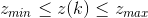), or the system output constraint.

**Remark**: To make the explanation simple and complete, in this implementation I implemented all constraints. But in the real implementation, you don't need to. For example, for  you can implement the minimum constraint only (without the maximum constraint) 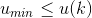. Or for example if you have 3 input, you can limit only the second input 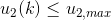 and set free the other. *Actually it is preferred (best practice) to implement hard-contraints as little as possible to ensure maximum feasible search space*.

The constraints formulation can be described as:
<p align="center">
<small>welp, I guess that's all XD</small></p>

&nbsp;

Then we can describe the full formulation of constrained MPC problem:
<p align="center">

**Note**: From this point onward, sometimes I'll use `MPC` subscript to denote MPC variables and `QP` subscript to denote Quadratic Programming solver variables. But if the context is known (e.g. In the MPC subsection/Active Set subsection), I'll drop the subscript to shorten the explanation. 

In the formulation above, 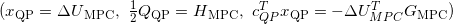 means when we call the QP solver from MPC subroutine, we need to scale the MPC variables accordingly 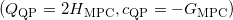.

# The Quadratic Programming Solver
In this implementation, I use (one of [several](https://en.wikipedia.org/wiki/Quadratic_programming#Solution_methods)) QP solver called [Active Set methods (ASM)](https://en.wikipedia.org/wiki/Active-set_method). The big idea of active set algorithm is searching the optimal  value by solving the QP problem (with inequality constraints) as QP problem with equality constraints (EQP). More concretely, we search  by iterating through EQP subproblem, and construct the EQP subproblem (more specifically the constraint matrix) from the set of QP constraints that is active at that iteration (hence the name).

In the wild, many recent reseach are using the more 'sexy' solver like [Interior Point methods (IPM)](https://en.wikipedia.org/wiki/Interior-point_method) because the IPM is faster for big QP problem. But in our case (i.e. MPC implementation for embedded system) we mainly deal with small (less than ten) state variables/actuator and small (less than twenty) prediction horizon (we're limited by the RAM size after all). In that case, the ASM will be faster than IPM. And by exploiting the MPC structure, we can reduce the computation time even further while increase the numerical stability (see [Active Set note: Solving the Linear Equation of KKT system](README.md#active-set-note-solving-the-linear-equation-of-kkt-system) subsection and [The MPC Implementation](README.md#the-second-implementation-optimized-active-set-with-schur-complement-of-kkt) subsection below).

On the [Wikipedia page](https://en.wikipedia.org/wiki/Active-set_method), the general structure of an active set algorithm is:
```
Find a feasible starting point
repeat until "optimal enough"
    solve the equality problem defined by the active set (approximately)
    compute the Lagrange multipliers of the active set
    remove a subset of the constraints with negative Lagrange multipliers
    search for infeasible constraints
end repeat
```

Using above structure, the active set algorithm used in this implementation can be described as: 


**Remark**: If the global optimum is inside the feasible region (i.e. the global optimum doesn't violate any constraints) and is not on the edge of any constraint, then it means there is no constraint active and the active set matrix 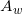 disappear. The KKT system equation simply becomes:
<p align="center">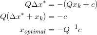</p>

As 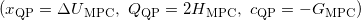, then the optimal control calculation becomes 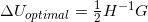 which exactly is the equation for [unconstrained MPC](https://github.com/pronenewbits/Arduino_Unconstrained_MPC_Library/blob/master/Formulation_of_Optimal_Control.png)! With this we can prove that the constrained MPC using active set solver is a generalization of unconstrained MPC (math is pretty nifty huh).

#### Active Set note: The Termination Condition
The termination condition on the last line of algorithm above 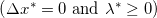 is called [Karush–Kuhn–Tucker conditions](https://en.wikipedia.org/wiki/Karush%E2%80%93Kuhn%E2%80%93Tucker_conditions). As the condition is applied on the solution of the KKT system on EQP subproblem (first line on iteration), then we can move the termination check just after we solve the KKT system.

#### Active Set note: Programming Implementation
The simplest way to implement the active set 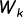 is by using an array of boolean, where the size of the array is as big as the number of constraints. That way, the operation of adding or removing the *i*-th constraint into/from  (i.e. the 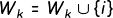 and 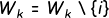 operations) simply becomes the operation of setting the *i*-th value of the array as `true` or `false`, accordingly. 

#### Active Set note: Generating the Feasible Starting Point
todo: calculate the starting point using linear programming. For now we set the starting point as zero (ok if the null space of x is inside the feasible search space, e.g. du_mpc,min < 0 and du_mpc,max > 0).

#### Active Set note: Solving the Linear Equation of KKT system
The most obvious way to solve the KKT system is by inverting the LHS matrix of the KKT equation (e.g. using Gauss-Jordan elimination):
<p align="center">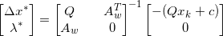</p>

Another not so obvious but very efficient solution is by using [Schur complement](https://en.wikipedia.org/wiki/Schur_complement) of the LHS matrix. Exploiting the fact that we can make the  matrix as a symmetric positive definite matrix, and moreover, a constant matrix.

Both approach to solve the KKT system is implemented below (as [naive implementation](README.md#the-first-implementation-the-naive-implementation) and [Schur complement implementation](README.md#the-second-implementation-optimized-active-set-with-schur-complement-of-kkt)).

#### Active Set note: Additional Termination Condition
Unlike unconstrained MPC (where the solver is basically a gain matrix), the constrained MPC solver use iteration to calculate the optimal control value (QP in worst case is NP-hard). It means in a real-time system, in worst case we need to terminate the iteration before the optimal control value can be calculated.

The nifty thing about ASM is that once we have optimal variable 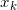 candidate that is inside feasible region, the next iteration of the variable 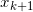 will be both:
a) Also inside the feasible region; and
b) More optimal than the previous iteration.

Using that fact, we can easily add another termination condition 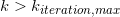 beside KKT condition  to make sure the MPC calculation still satisfy the real-time requirement. The other option is to use a real-time timer as the termination condition. We then can use the not-the-most-optimal-but-still-feasible solution as the controller output.

#### Active Set: Wrap it up
The Active Set pseudo code then can be described as:
<p align="center"></p>

For more explanation about ASM, [these slides](https://people.cs.umu.se/eddiew/optpde2016/QP.pdf) or these pages ([here](https://neos-guide.org/content/quadratic-programming) and [here](https://neos-guide.org/content/quadratic-programming-algorithms)) are quite good at explaining the mechanism behind active set for quadratic programming problem. But for more in-depth treatment of this algorithm, the best resource is of course [Nocedal & Wright's Numerical Optimization](https://www.google.com/books/edition/Numerical_Optimization/7wDpBwAAQBAJ?hl=en&gbpv=0), chapter 16. Just be aware, the tutorials I linked (and many QP formulation) use inequality constraint in the form 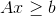 while we use 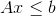 (just multiply the inequality with  to change from one form to another).

&nbsp;

# The MPC Implementation
The implementations of the MPC control calculation consist of two main implementations, each of the implementation is self contained in each folder and calculate the same control output (theoretically).

### The first implementation: The Naive Implementation
The Naive Implementation algorithm is just a direct implementation of the MPC derivation above. The MPC algorithm can be described as (the source code can be found in "[mpc_constrained_naive_engl](mpc_constrained_naive_engl)" folder, especially see "[mpc.cpp](mpc_constrained_naive_engl/mpc.cpp)" file):
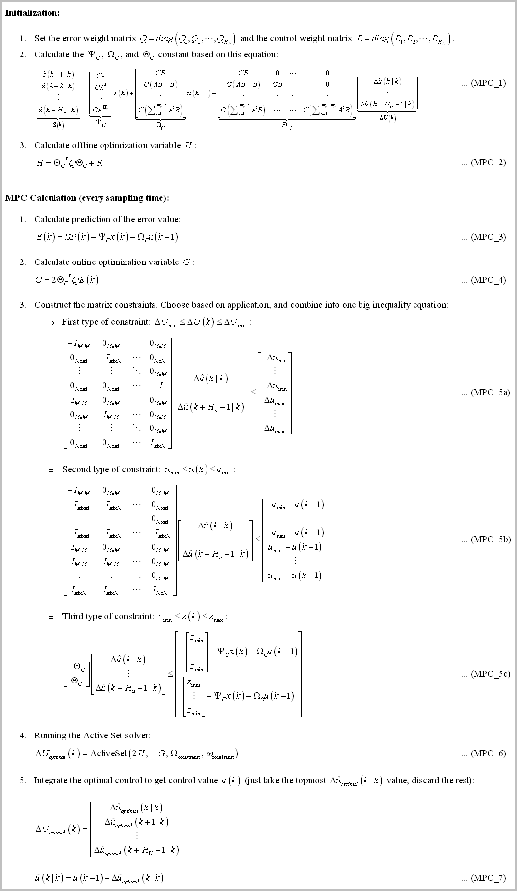

The active set subroutine is exactly [the same as explained above](README.md#active-set-wrap-it-up) where the KKT solution is calculated by matrix inversion (the code is also inside "[mpc.cpp](mpc_constrained_naive_engl/mpc.cpp#L240)" file):
<p align="center">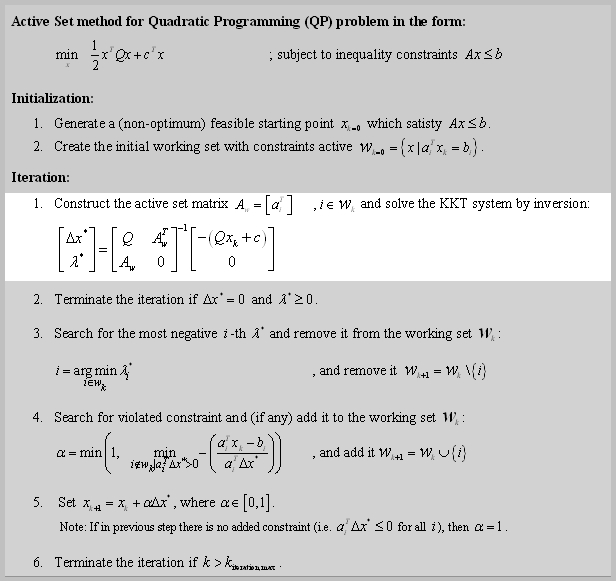</p>

&nbsp;

### The second implementation: Optimized Active Set with Schur Complement of KKT
There are several things we can do to lower the computation cost:
1. The LHS of constraint calculation at (MPC_5a)-(MPC_5c) of naive implementation is constant. We should move them into MPC initialization step.
2. (Some of calculation inside) `G` matrix at (MPC_4) of naive implementation (specifically the 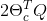 portion) is actually constant. We should move them into MPC initialization step.
3. If we limit the selection of the MPC `Q` and `R` weight matrices as diagonal and all its entry positive (in fact we've been doing it since [the unconstrained implementation](https://github.com/pronenewbits/Arduino_Unconstrained_MPC_Library#the-background)), then 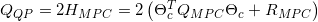 is also a symmetric positive definite matrix (here I denote `Q` and `R` weight matrices with `MPC` subscript to differentiate them with `Q` matrix of QP solver).


Based on the last point, we can speed up the solution calculation of the KKT system:
<p align="center">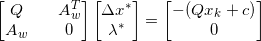</p>

First we apply block Gaussian elimination to the KKT system using  as the pivot. Then the KKT system will becomes:
<p align="center">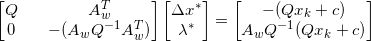</p>

Where the left matrix of the LHS equation is the [Schur complement](https://en.wikipedia.org/wiki/Schur_complement) of 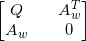, and the solution of KKT system then can be calculated as:
<p align="center">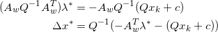</p>

At first glance, the calculation become more complicated than the naive inversion, but:
1. The 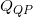 matrix is constant, so also its inverse.
2. As the  is positive definite, so is the matrix 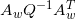. It means we can use [Cholesky decomposition to solve the first equation](https://en.wikipedia.org/wiki/Cholesky_decomposition#Applications) instead of calculating the inversion of it. Whenever applicable, the Cholesky decomposition is faster and more stable numerically than Gaussian elimination.
3. In many cases, the active set matrix  dimension is smaller than  dimension, so the matrix  will be smaller than  and obviously smaller than , making the computation even more faster, relative to the naive inversion.
4. For the MPC calculation, the KKT matrix  is the biggest matrix constructed. By avoid constructing it, we can reduce the memory used by the MPC.

\* As [stated on the unconstrained version](https://github.com/pronenewbits/Arduino_Unconstrained_MPC_Library#the-third-implementation-description-the-numerically-robust-version), if we don't take care of it, the 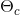 (although a constant) is often ill conditioned. So care must be taken to make sure the  will behave as good as possible.

The MPC algorithm then can be described as (the source code can be found in "[mpc_constrained_schur_engl](mpc_constrained_schur_engl)" folder, especially see "[mpc.cpp](mpc_constrained_schur_engl/mpc.cpp)" file):
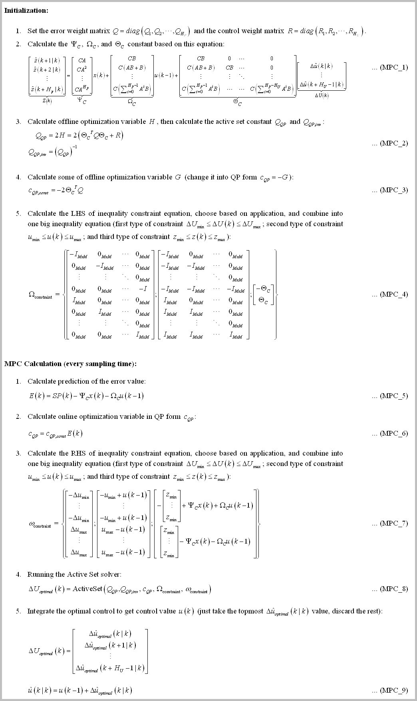

Where the active set subroutine can be described as (the code is also inside "[mpc.cpp](mpc_constrained_schur_engl/mpc.cpp#L256)" file):
<p align="center">
  <a href="documentation_resources/ActiveSet_schur.png">
    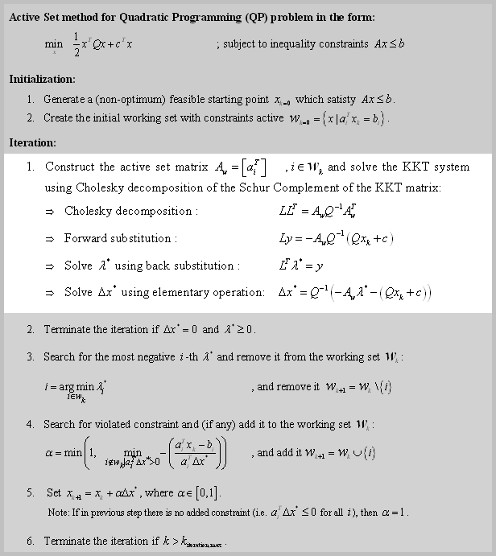
 </a>
</p>


# How to Use
The MPC code is self contained and can be accessed in the folder [mpc_constrained_naive_engl](mpc_constrained_naive_engl) or [mpc_constrained_schur_engl](mpc_constrained_schur_engl). Inside you will find these files:
- `matrix.h/cpp` : The backbone of all my code in this account. This files contain the class for Matrix operation.
- `mpc.h/cpp` : The source files of the MPC Class.
- `konfig.h` : The configuration file.
- `mpc_constrained_*_engl.ino` : The arduino main file (for naive/schur version).

For custom implementation, typically you only need to modify `konfig.h` and `*.ino` files. Where basically you need to:
1. Set the length of `X, U, Z` vectors and sampling time `dt` in `konfig.h`, depend on your model.
2. Set the MPC parameters like `Hp (Prediction Horizon)` or `Hu (Control Horizon)` in `konfig.h`, depend on your application.
3. Enable/disable and set the MPC constraints parameters like `DU`, `U`, or `Z` in `konfig.h`, depend on your application.
4. Define the (linear) matrix system `A, B, C` and MPC initialization value `weightQ, weightR` in the `*.ino` file.

After that, you only need to initialize the MPC class, set the non-zero initialization matrix by calling `MPC::vReInit(A, B, C, weightQ, weightR)` function at initialization, and call the function `MPC::bUpdate(SP, x, u)` at every sampling time to calculate the control value `u(k)`.

&nbsp;

*For Arduino configuration (`SYSTEM_IMPLEMENTATION` is set to `SYSTEM_IMPLEMENTATION_EMBEDDED_ARDUINO` in `konfig.h`):
The code is tested on compiler Arduino IDE 1.8.10 and hardware Teensy 4.0 Platform.

*For PC configuration (`SYSTEM_IMPLEMENTATION` is set to `SYSTEM_IMPLEMENTATION_PC` in `konfig.h`):
The code is tested on compiler Qt Creator 4.8.2 and typical PC Platform.


**Important note: For Teensy 4.0, I encounter RAM limitation where the `MATRIX_MAXIMUM_SIZE` can't be more than 28 (if you are using double precision) or 40 (if using single precision). If you already set more than that, your Teensy might be unable to be programmed (stack overflow make the bootloader program goes awry?). The solution is simply to change the `MATRIX_MAXIMUM_SIZE` to be less than that, compile & upload the code from the compiler. The IDE then will protest that it cannot find the Teensy board. DON'T PANIC. Click the program button on the Teensy board to force the bootloader to restart and download the firmware from the computer.**

(The maximum matrix size 28 very much limit the `HP, Hu`, and constraints implementation, I guess [500 kB of Teensy stack](https://forum.pjrc.com/threads/58839-Teensy-4-0-memory-allocation) is not enough for constrained MPC huh...)
next step: implement [memory pool](https://en.wikipedia.org/wiki/Memory_pool) for Matrix library!

# Some Benchmark
To demonstrate the code, I've made the MPC control a state-space model (HIL style) for Jet Transport Aircraft (ref: https://www.mathworks.com/help/control/ug/mimo-state-space-models.html#buv3tp8-1), where the configuration is (4 state, 2 input, 2 output LTI system) + Hp=4 & Hu=3. The compiler is Arduino IDE 1.8.10 with default setting (compiler optimization setting: faster) and the hardware is Teensy 4.0. Note that I'm somewhat 'cheating' by using the state variable `x` directly from the HIL system into the MPC calculation (in the real world it should be inferred using some kind of observer. But for benchmark purpose, the result should be the same).  

These are the results of simulating the model with several constraint configurations (the calculation benchmark below):
1. The result for no-constraint. The MPC behave like [the unconstrained version](https://github.com/pronenewbits/Arduino_Unconstrained_MPC_Library#some-benchmark).
<p align="center">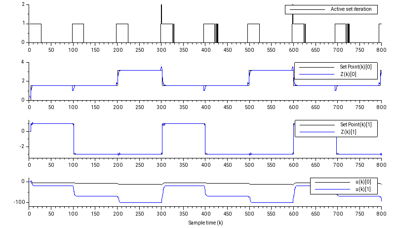</p>

2. The result with slew rate constraints added 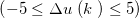: Maximum 4 active-set iterations. Take attention that the  signals become slower to change.
<p align="center">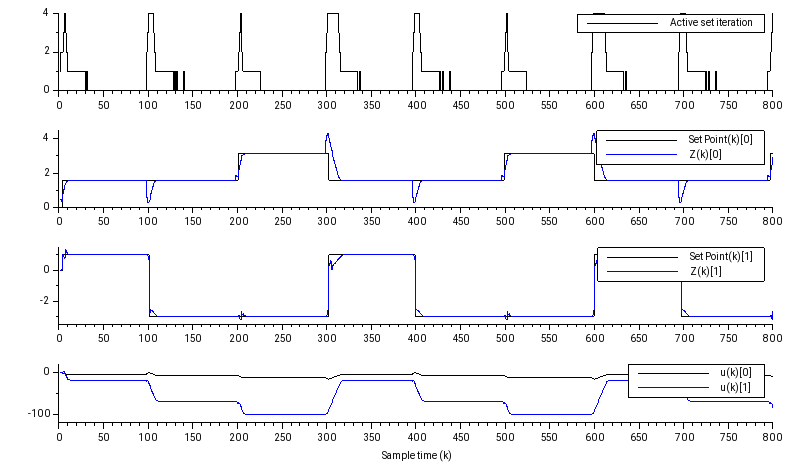</p>

3. The result when slew rate constraints *and* output constrains added 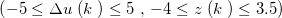: Maximum 5 active-set iterations. Take attention that beside the  signals become slower to change, the output  at ~300th sampling time don't overshoot anymore.
<p align="center">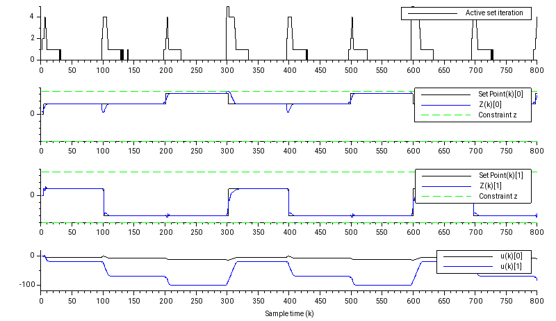</p>
The result when zoomed at 300-th sampling time:
<p align="center">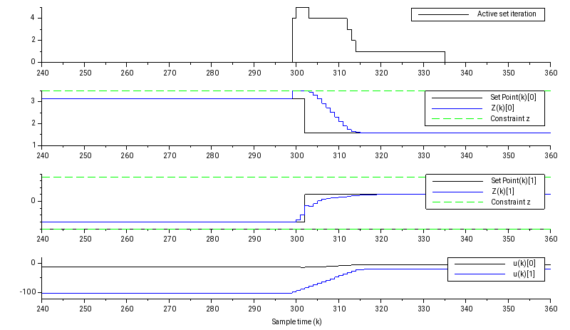</p>

All result are plotted using [Scilab](https://www.scilab.org/).

The most interesting result came from analyzing the computation needed by the MPC, the data are collected using this code snippet:
```
u64compuTime = micros();
MPC_HIL.bUpdate(SP, x, u);
u64compuTime = (micros() - u64compuTime);        
_maxu64compuTime < u64compuTime? _maxu64compuTime = u64compuTime: 0;
```

The benchmark data variable `_maxu64compuTime`, in microseconds (lower is better):
<p align="center">
  
|Constraints Configuration|Maximum Active Set iteration|Naive Implementation|Implementation using Schur Complement|Schur Complement without Bounds Checking|
|:---:|:---:|:----:|:---:|:---:|
|No-constraint|2|169 us|35 us|11 us|
||4|556 us|170 us|67 us|
|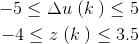|5|886 us <BR>(117.2 us/iteration)|327 us <BR>(65.4 us/iteration)|127 us <BR>(25.4 us/iteration)|

(Nice)
</p>

As can be seen here, the optimized version using Schur complement implementation gives computational boost up to 2 to 3 times compared the naive version. Even if we optimize the naive version by doing [the first two optimization of the second implementation](README.md#the-second-implementation-optimized-active-set-with-schur-complement-of-kkt) (moving the LHS constraint and some of `G` matrix calculation into initialization step), we can only cut the computation time around 40 us (try it!). It means the bulk of the speed up came from the choice of the KKT system solver. Note that using Schur complement method (some publication called it 'Range-space methods') is not the only way to solve the KKT system of EQP, there are Null-Space methods (where the  matrix doesn't need to be positive definite), Conjugate gradient method, etc. Refer to mathematical optimization textbooks to read more on this topic. 

The interesting thing happens when we disabled the matrix bounds checking in `konfig.h` (if you customize/change the plant system, you need to harden the system before disable it), we can get further increase throughput 2 to 4 times compared with bounds checking enabled, where the best result is **127 us** for a fully functioning constrained MPC. That means this MPC library is capable to tackle a reasonably complex very fast system at several hundred (or even thousand) Hz sampling rate (and in a $20 hardware form!).

Using static analyzer, the biggest matrix constructed is  matrix where the worst-case size is `(2xHuxM) + (2xHpxZ)` when we enable  constraints. The matrix maximum size will be `(2x4x2)+(2x3x2) = 28`. This is the `MATRIX_MAXIMUM_SIZE` value we used in this benchmark.

Note that when we use the naive version, the worst case matrix size is actually the dimension of  which is `(HpxZ) + (2xHuxM) + (2xHpxZ)` or 36 (we don't use it here because of stack overflow).

### More Interesting Benchmark
Sometimes I just want to see how far I can push this system to the extreme. Using the same model (Jet Transport Aircraft), the lowest `Hp` & `Hu` values that still capable to tracking the set point are `Hp=3` and `Hu=1` (with degraded transient response). The biggest matrix is  with  constraints at the size `(2*Hu*M)+(2*Hp*Z) x (Hu*M) = (2*1*2)+(2*3*2)x(1*2) = 16x2 matrix`.

The benchmark data variable `_maxu64compuTime`, in microseconds are (lower is better):
<p align="center">

|Constraints Configuration|Maximum Active Set iteration|Implementation using Schur Complement|Schur Complement without Bounds Checking|
|:---:|:---:|:----:|:---:|
|No-constraint|1|11 us|4 us|
||2|26 us|13 us|
||2|52 us|28 us|

(Noice) With this we're entering the tens to (almost) hundred kHz application (\*⌄\*)
</p>
This is the result:
<p align="center">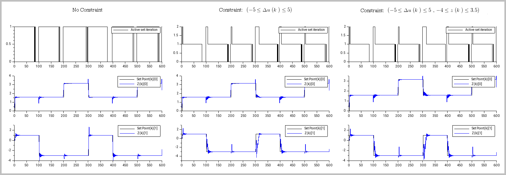</p>

And when zoomed for  and  constraints (the MPC still able to control the system while still comply with the constraints):
<p align="center">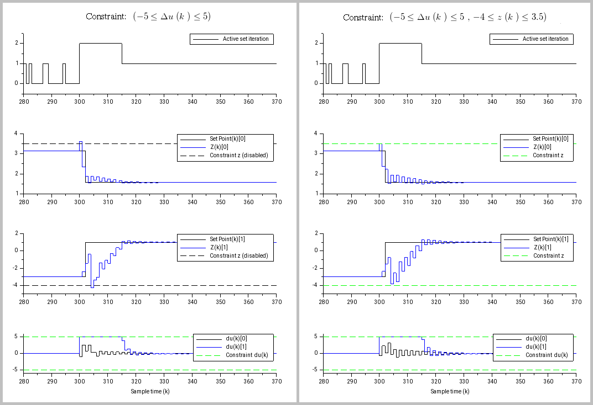</p>


**Note** that this benchmark still using [zero vector as the ASM starting value](README.md#active-set-note-generating-the-feasible-starting-point). Expect additional 20-30% of computation time when we use linear programming to search for the starting point (will be implemented soon!).

# Closing Remark
I hope you can test & validate my result or inform me if there are some bugs / mathematical error you encounter along the way! (or if you notice some grammar error in the documentation).

I published the code under CC0 license, effectively placed the code on public domain. But it will be great if you can tell me if you use the code, for what/why. That means a lot to me and give me motivation to expand the work (⌒▽⌒)
