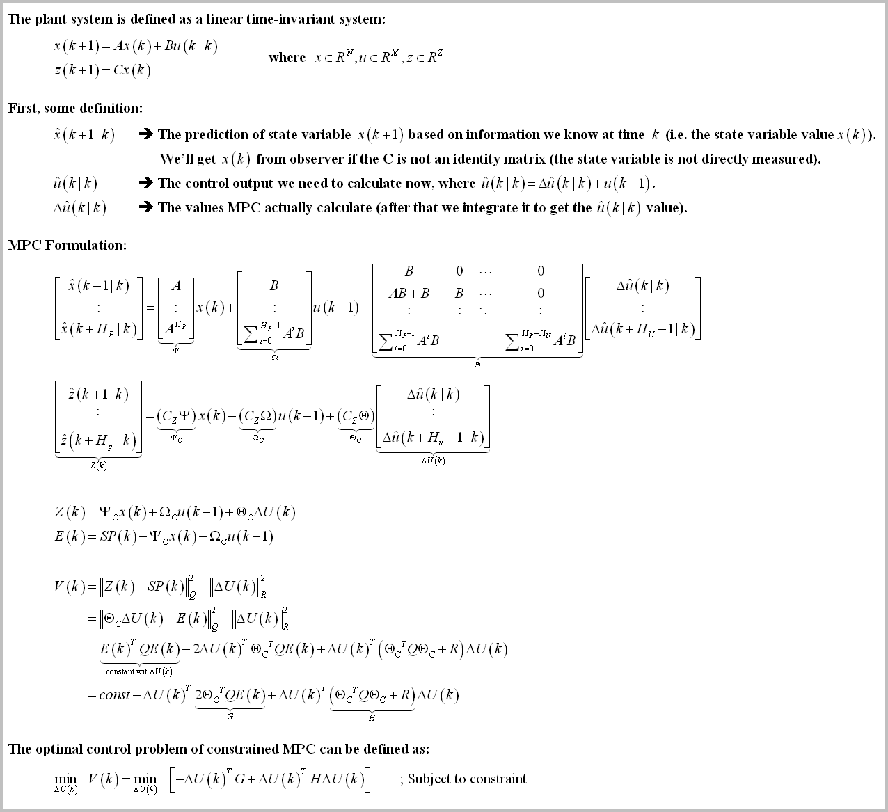
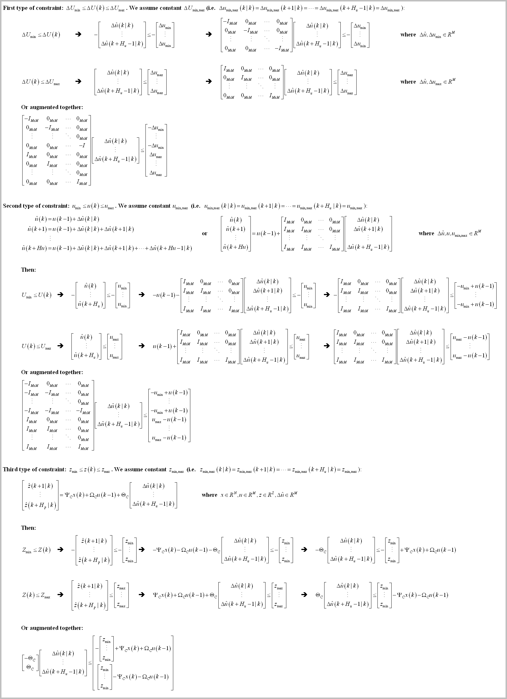
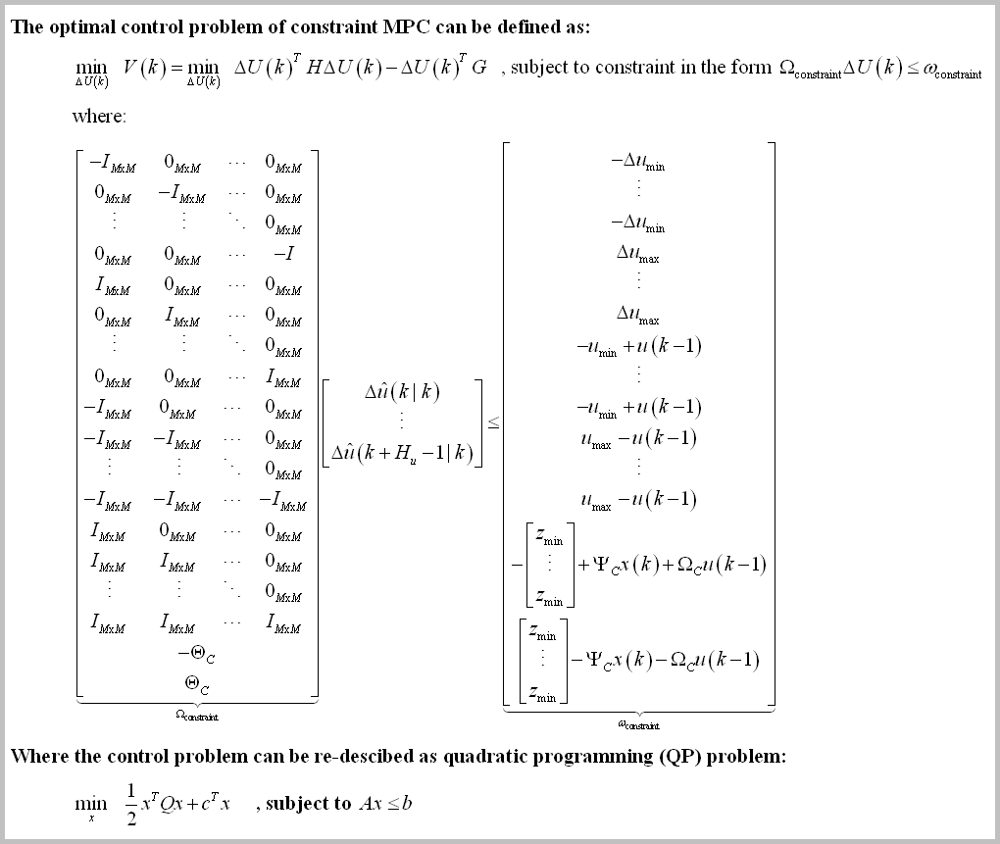
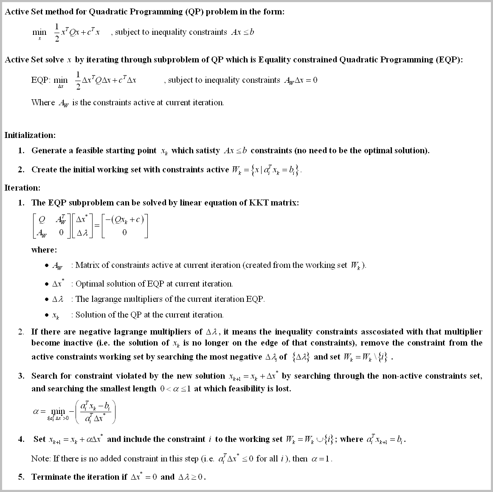
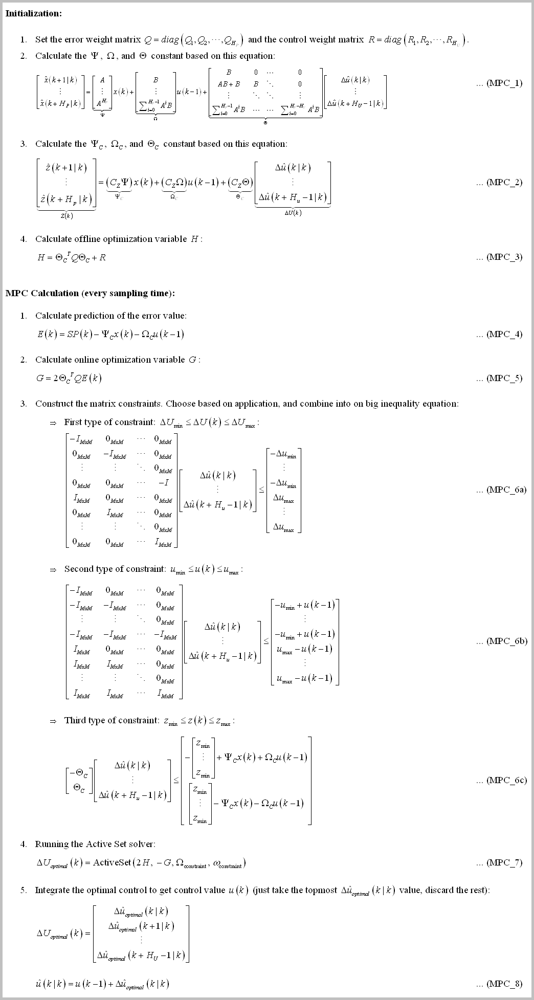
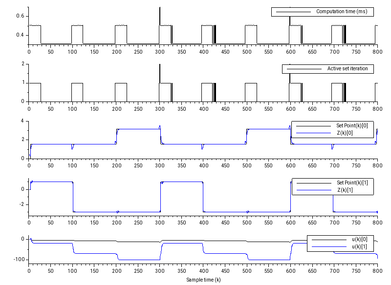
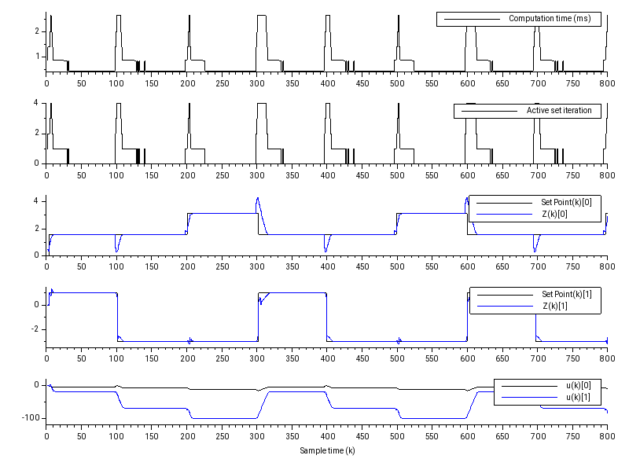
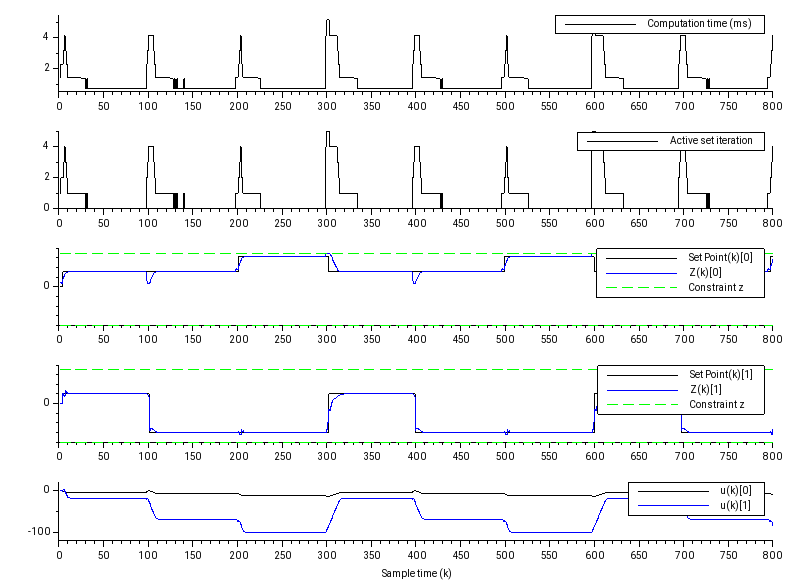
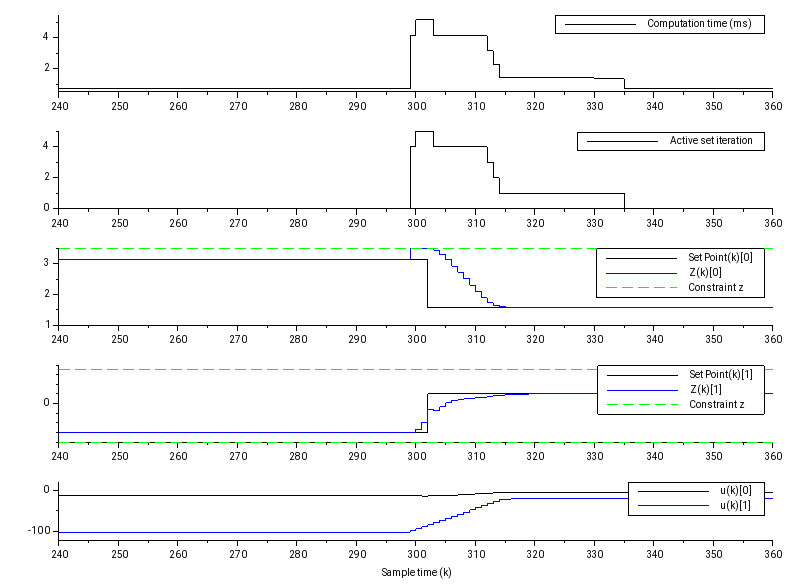

# Arduino_Constrained_MPC_Library
This is a compact Constrained (linear) Model Predictive Control (MPC) library for Teensy4.0/Arduino system (or real time embedded system in general).
- It's not using Eigen (small source code - more simple to understand).
- It's not using C++ Standard Library/std (for embedded consideration).
- If you set `SYSTEM_IMPLEMENTATION` to `SYSTEM_IMPLEMENTATION_EMBEDDED_NO_PRINT` in `konfig.h`, the code is platform agnostic (not using any library beside these C header files: `stdlib.h`, `stdint.h`, and `math.h`).
- There's no malloc/new/free dynamic memory allocation for real time application (but using heavy stack local variables, so you need to run it through static memory analyzer if you are really concerned about implement this in mission critical hard real time application).

The constrained MPC version can be found in [my other repository](https://github.com/pronenewbits/Arduino_Unconstrained_MPC_Library/).

# The Background
This is the continuation of my previous repo [Arduino_Unconstrained_MPC_Library](https://github.com/pronenewbits/Arduino_Unconstrained_MPC_Library/), so you should read it before continue. As with my other repo, the main goal is for the student to learn the MPC concept (I've made decision to sacrifice speed to get best code readability I could get) while still capable of tackling real-time control system implementation (the code is computed in **3 ms to 7 ms**! See *Some Benchmark* section below).

To recap, the MPC formula derivation can be described as (I'm using Jan Maciejowski's *Predictive Control with Constraints* as reference, great book btw) :

We have 3 type of constraints:
1.  constraint (i.e. ), or the actuator slew rate constraint.
2.  constraint (i.e. ), or the actuator output constraint.
3.  constraint (i.e. ), or the system output constraint.

**Note**: To make the explanation simple, in this implementation I use full rank constraints. But in the real implementation, you don't need to (e.g. for  you can only implement the minimum constraint (without the maximum constraint) ). Or for example you have 3 input, you can only constraining the second input  and set free the other.

The constraints formulation can be described as:

<small>welp, I guess that's all XD</small>

&nbsp;

Then we can describe the full formulation for Constrained MPC:

**Note**: You don't need to implement the full contraints matrix. Actually it is preferred to implement hard-contraints as little as possible to ensure maximum feasible search space.

# The Quadratic Programming Solver
In this implementation, I use (one of many) QP solver called [Active Set](https://en.wikipedia.org/wiki/Active-set_method). The big idea of active set algorithm is searching the optimal  value by solving the QP problem (with inequality constraints) as QP problem with equality constraints (EQP). The Active Set algorithm used in this implementation can be described as: 

For more explanation, [these slides](https://people.cs.umu.se/eddiew/optpde2016/QP.pdf) is quite good at explaining the mechanism behind Active Set for Quadratic Programming problem. Just be aware, that slide (and many QP formulation) use inequality constraint in the form  while we use  (just multiply the inequality with  to change from one form to another).

# Wrap it up
The constrained MPC then can be described as:

**Note**: . So at (MPC_7), .

# How to Use
The MPC code is self contained and can be acessed in the folder [mpc_constrained_engl](mpc_constrained_engl) (this is the template project). Inside you will find these files:
- `matrix.h/cpp` : The backbone of all my code in this account. This files contain the class for Matrix operation.
- `mpc.h/cpp` : The source files of the MPC Class.
- `konfig.h` : The configuration file.
- `mpc_constrained_engl.ino` : The arduino main file (this is only the template file).

For custom implementation, typically you only need to modify `konfig.h` and `*.ino` files. Where basically you need to:
1. Set the length of `X, U, Z` vectors and sampling time `dt` in `konfig.h`, depend on your model.
2. Set the MPC parameters like `Hp (Prediction Horizon)` or `Hu (Control Horizon)` in `konfig.h`, depend on your application.
3. Enable/Disable and set the MPC constraints parameters like `DU`, `U`, or `Z` in `konfig.h`, depend on your application.
4. Define the (linear) matrix system `A, B, C` and MPC initialization value `weightQ, weightR` in the `*.ino` file.

After that, you only need to initialize the MPC class, set the non-zero initialization matrix by calling `MPC::vReInit(A, B, C, weightQ, weightR)` function at initialization, and call the function `MPC::bUpdate(SP, x, u)` at every sampling time to calculate the control value `u(k)`.

&nbsp;

*For Arduino configuration (`SYSTEM_IMPLEMENTATION` is set to `SYSTEM_IMPLEMENTATION_EMBEDDED_ARDUINO` in `konfig.h`):
The code is tested on compiler Arduino IDE 1.8.10 and hardware Teensy 4.0 Platform.

*For PC configuration (`SYSTEM_IMPLEMENTATION` is set to `SYSTEM_IMPLEMENTATION_PC` in `konfig.h`):
The code is tested on compiler Qt Creator 4.8.2 and typical PC Platform.

**Important note: For Teensy 4.0, I encounter RAM limitation where the `MATRIX_MAXIMUM_SIZE` can't be more than 14 (if you are using double precision) or 28 (if using single precision). If you already set more than that, your Teensy might be unable to be programmed (a bug in the Teensy bootloader?). The solution is simply to change the `MATRIX_MAXIMUM_SIZE` to be less than that, compile & upload the code from the compiler (the IDE then will protest that it cannot find the Teensy board), and click the program button on the Teensy board to force the bootloader to restart and download the firmware from the computer.**

(The maximum matrix size 28 very much limit the `HP, Hu`, and constraints implementation, I guess 1 MB of Teensy RAM is not enough for constrained MPC huh...) 

# Some Benchmark
To demonstrate the code, I've made the MPC control a state-space model (HIL style) for Jet Transport Aircraft (ref: https://www.mathworks.com/help/control/ug/mimo-state-space-models.html#buv3tp8-1), where the configuration is (4 state, 2 input, 2 output LTI system) + Hp=4 & Hu=3. The compiler is Arduino IDE 1.8.10 with default setting (compiler optimization setting: faster) and the hardware is Teensy 4.0.

The computation time needed to compute one iteration of `MPC::bUpdate(SP, x, u)` function are (*drum-roll*):
1. Around **300 us** to **700 us** for no-constraint.

2. Around max **2.648 ms** (max 4 Active set iteration) when slew rate constraints added (). Take attention that the  signals become slower to change.

3. Around max **4.139 ms** (max 4 Active set iteration) when slew rate constraints *and* output constrains added (, ). Take attention, beside the  signals become slower to change. The output  at ~300th sampling time don't get overshoot anymore.

The result when zoomed at 300-th sampling time:

All result plotted using [Scilab](https://www.scilab.org/).

# Closing Remark
The matrix.h library's code documentation is still in Indonesian, but I plan to translate it into English soon (stay tuned!). In the meantime, it will be nice if you can test & validate my result or inform me if there are some bugs you encounter along the way! (or if you notice some grammar error in the documentation).

I published the code under CC0 license, effectively placed the code on public domain. But it will be great if you can tell me if you use the code, for what/why. That means a lot to me and give me motivation to expand the work (⌒▽⌒)
